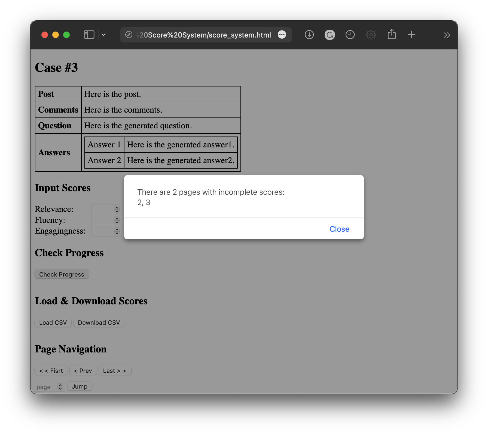

# Simple HTML Score System
Welcome to the Score System. This [page](./score_system.html) allows you to input scores for different categories and navigate between different pages using arrow keys. 

Here are some key features:

- Use the left and right arrow keys to switch between pages.
- Use the up and down arrow keys to switch between different score options.
- Use the tab key to navigate between different score categories.
- You can load your saved score data when you reopen the page.

**Please note that it is important to save your score data to your local storage before closing or refreshing the page.**
 
Writen by Yixia Li and ChatGPT.

Here is some screen shots.

